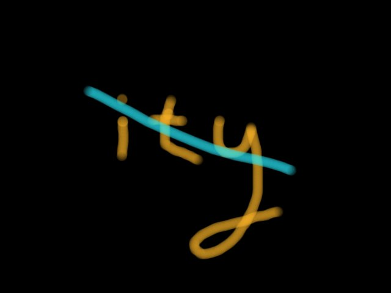

# level 12
### [http://www.pythonchallenge.com/pc/return/evil.html](http://www.pythonchallenge.com/pc/return/evil.html)

---

---

### clues:
 - page source: The name of the picture is evil1.jpg There are probably more.
 - evil2.jpg: not jpg - _.gfk
 - evil2.gfk: is a file
 - evil3.jpg: not more evils..
 - evil4.jpg: something weird
 - evil5.jpg: error 404 Not Found
 - total = 5 (0-4)
---

### task:
Divide evil2.gfk into five pictures

---
### solution:
- get the page source from url
    #### code: 
    ```
    def get_page_source(url):
      user = 'huge'
      password = "file"
      res = requests.get(url, auth=HTTPBasicAuth(user, password)).content
      return res
  ```
- division into five
  #### code:
  ```
  def division_into_five(data):
    five_part = []
    for i in range(5):
        five_part.append(data[i::5])
    return five_part
  ```
- create_image
  #### code:
  ```
  def create_image(list_image):
    for i in range(len(list_image)):
        open('%d.jpg' % i, 'wb').write(list_image[i])
    return 'disproportional'
  ```
  return: 

  
  
  
  
  
  
  
  
  


- Now all that remains is to change the end of the url used method replace()
  #### code:
  ```
  def replace_url(url, old_url, url_to_replace):
    new_url = url.replace(old_url, url_to_replace)
    webbrowser.open(new_url)
    return new_url
  ```
 ---
### url to the next level:
 [http://www.pythonchallenge.com/pc/return/disproportional.html](http://www.pythonchallenge.com/pc/return/disproportional.html)

    